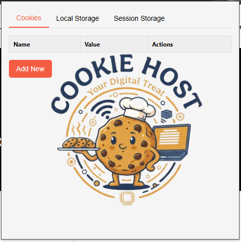

# Cookie Editor Pro - Cookie and Storage Editor

A professional cookie and storage editor for your browser.

## Features

* **Edit, create, and delete cookies, local storage, and session storage.**
* **Modern and user-friendly interface.**
* **Tabbed interface to easily switch between storage types.**
* **Modal form for a better user experience when editing and creating entries.**

## Screenshot



## Installation

1. **Clone the repository:**

    ```bash
    git clone https://github.com/Ip-Tec/Cookie-Editor-Pro.git
    ```

2. **Load the extension in your browser:**

    * Open your browser's extension page.
    * Enable "Developer mode".
    * Click on "Load unpacked".
    * Select the cloned repository folder.

## Usage

1. Click on the extension icon in your browser's toolbar.
2. The extension will display the cookies, local storage, and session storage for the current tab.
3. You can then edit, create, or delete entries as needed.

## License

This project is licensed under the MIT License - see the [LICENSE](LICENSE) file for details.
